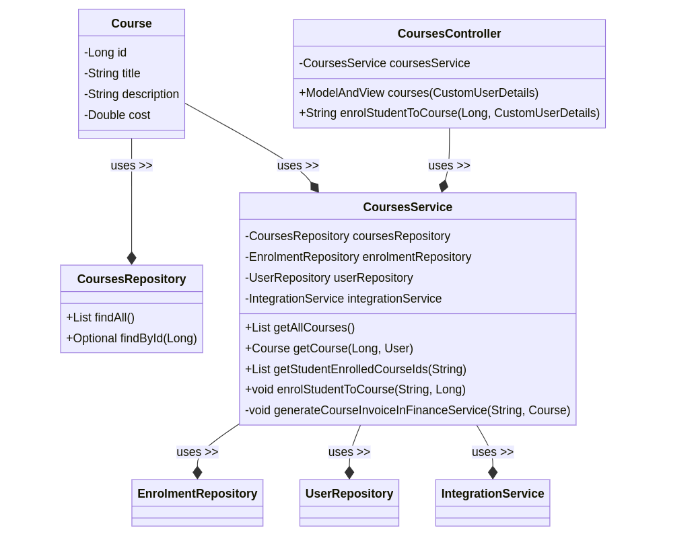

### Project template generation - used Spring Initializer

StudentPortal microservice template has been initialized using https://start.spring.io/. 

Following config and dependencies has been selected.


Generate sources has been unzipped to `student_service` directory before
starting development.

### System requirements

Requirements:

* java
* docker

On Ubuntu OS, you can install below deps using command: 
```
make install-system-deps && source $HOME/.bashrc
```
On other OSes you need to install it manually other way before working with
this application.

### Architectural Overview


### Getting started

Run all docker containers of the microservices using command:
```
make up
```

It is alias which triggers series of docker commands to make all services of
app up and running. 
The details of this alias can be found in Makefiles of each service:
* [Makefile of student_service](./student_service/Makefile)
* [Makefile of finance_service](./finance_service/Makefile)
* [Makefile of library_service](./library_service/Makefile)

Aliases of commands in Makefile simplifies work with the app during development.
Instead of remember and type long docker commands with parameters we can save
them into aliases in Makefile and use simple commands ex. 'make up'.

Below more other make commands will be presnted using similar concept.

Insert initial data into database using:
```
make apply-migrations
```

Make sure application is up and running using command:
```
docker ps
```
If application is up-and-running you should see following docker containers and status of each one should be 'Up':


If you see **ALL** the above containers up-and-running (status 'Up') open your web browser with this
URL: 

* **student_service** - [http://localhost:8080](http://localhost:8080)
* **finance_service** - [http://localhost:8081](http://localhost:8081)
* **library_service** - [http://localhost:8082](http://localhost:8082)

If you don't see **ALL** the containers up-and-running, then you can try clean the app and start build from scratch:
```
make clean
make up
```

## Using portal

If you see the above 6 containers up and running it means your application is
running properly. You can start to use it.

### Register user

* open register form: [http://localhost:8080/register](http://localhost:8080/register)
* register your user
* you should be redirected to login page

### Login registered user

* open login form: [http://localhost:8080/login](http://localhost:8080/login)
* login registered user
* you should be redirected to welcome home page

### Login new registered user to finance service

* get studentId of new registered user from [Profile page](http://localhost:8080/profile).
* Default PIN of Library Service is '000000'.
* got to [Finance Service](http://localhost:8081) and login

### Login new registered user to library service

* get studentId of new registered user from [Profile page](http://localhost:8080/profile).
* Default PIN in Library Service is '123456'.
* got to [Library Service](http://localhost:8082) and login

### View/edit student profile

* open student profile page (login required first): [http://localhost:8080/profile](http://localhost:8080/profile)
* you should view your profile page (username, firstname, surname, studentId)
* click 'Edit profile' to edit your profile
* update your first name and/or username and click 'Update profile'
* when done you should be redirected back to your profile page where up-to-date data should be displayed

### View courses

* open view courses page (login required first): [http://localhost:8080/courses](http://localhost:8080/courses)
* you should see list of available courses

### Enrol in courses

* open view courses page (login required first): [http://localhost:8080/courses](http://localhost:8080/courses)
* you should see list of available courses
* on the right hand side of the courses you should see 'Enroll' button
* click this button to enroll in the course => It should change to the workd 'Enrolled'
* you have been enrolled in the course

### View enrolments

* open view courses page (login required first): [http://localhost:8080/enrolments](http://localhost:8080/enrolments)
* you should see list of enrolled courses

### View graduation status

* open view courses page (login required first): [http://localhost:8080/graduation](http://localhost:8080/graduation)
* you should see your graduation status and list of invoices to pay (if any outstanding invoices exist)
* you can then get reference numbers of each invoice and pay them in Finance Service
* get studentId of new registered user from [Profile page](http://localhost:8080/profile). Default PIN is '000000'.
* login to [Finance Service](http://localhost:8081) using the above studentId nad PIN and pay them
* if all invoices are paid your graduation status should be 'ELIGABLE TO GRADUATE'


### Tests

* test library has been added in the gradle (line 29 in [student_service/build.gradle](./student_service/build.gradle))
* to **run tests** you can use convenient command from Makefile: **`make run-tests`**
* to **open test report** after running tests use can use command from Makefile: **`make test-report`**

### Diagrams

#### Class diagram of courses-related classes 


