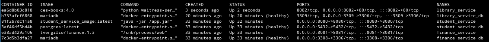

## Project template generation - used Spring Initializer

StudentPortal microservice template has been initialized using https://start.spring.io/. 

Following config and dependencies has been selected.


Generate sources has been unzipped to `student_service` directory before
starting development.

### System requirements

Requirements:

* java 11
* docker

On Ubuntu OS, you can install below deps using command: 
```
make install-system-deps && source $HOME/.bashrc
```
On other OSes you need to install it manually other way before working with
this application.

### Getting started

## Quick start

Run all docker containers of the application using command:
```
make up
```

Make sure application is up and running using command:
```
docker ps
```
If application is up-and-running you should see following docker containers:


If you see **ALL** the above containers up-and-running open your web browser with this
URL: 

* **student_service** - [http://localhost:8080](http://localhost:8080)
* **finance_service** - [http://localhost:8081](http://localhost:8081)
* **library_service** - [http://localhost:8082](http://localhost:8082)

### Student service

Open **[http://localhost:8080](http://localhost:8080)** in your web browser

You should see login page. You can login into the application using
credentials:

* username: 'user'
* passoword: use `docker logs student_service | grep password` command to get autogenerated password

### Finance service

Open **[http://localhost:8081](http://localhost:8081)** in your web browser

You should see invoices search page. 
You can search invoice by it's reference. Sample invoice references you an find
in [./finance_service/migrations/mysql-migrations.sql](./finance_service/migrations/mysql-migrations.sql)

* type sample invoice reference: 'ABCD1234'
* click 'Find Invoice' 
* click 'Pay Invoice'
* search invoice again and see status of the invoice is 'Paid' 

### Library service

Open **[http://localhost:8082](http://localhost:8082)** in your web browser

You should see login page. You can login into the application using
credentials:

* student id: 'c3781247' (from [./library_service/migrations/mysql-migrations.sql](./library_service/migrations/mysql-migrations.sql))
* PIN: 000000
