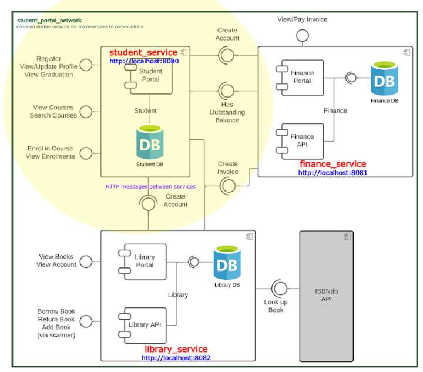

### Project template generation - used Spring Initializer

StudentPortal microservice template has been initialized using https://start.spring.io/. 

Following config and dependencies has been selected.


Generate sources has been unzipped to `student_service` directory before
starting development.

### System requirements

Requirements:

* java 11
* docker

On Ubuntu OS, you can install below deps using command: 
```
make install-system-deps && source $HOME/.bashrc
```
On other OSes you need to install it manually other way before working with
this application.

### Architectural Overview



### Getting started

Run all docker containers of the application using command:
```
make up
```

Make sure application is up and running using command:
```
docker ps
```
If application is up-and-running you should see following docker containers:


If you see **ALL** the above containers up-and-running open your web browser with this
URL: 

* **student_service** - [http://localhost:8080](http://localhost:8080)
* **finance_service** - [http://localhost:8081](http://localhost:8081)
* **library_service** - [http://localhost:8082](http://localhost:8082)

### Student service

Open **[http://localhost:8080](http://localhost:8080)** in your web browser

You should see login page. You can login into the application using
credentials:

* username: 'user'
* passoword: use `docker logs student-service | grep password` command to get autogenerated password

### Finance service

Open **[http://localhost:8081](http://localhost:8081)** in your web browser

You should see invoices search page. 
You can search invoice by it's reference. Sample invoice references you an find
in [./finance_service/migrations/mysql-migrations.sql](./finance_service/migrations/mysql-migrations.sql)

* create new account:
```
 curl -X POST http://localhost:8081/accounts -H "Content-Type: application/json" -d '{ "studentId": "c1234567" }'
```
* type sample invoice reference: 'ABCD1234'
* click 'Find Invoice' 
* click 'Pay Invoice'
* search invoice again and see status of the invoice is 'Paid' 

### Library service

Open **[http://localhost:8082](http://localhost:8082)** in your web browser

You should see login page. You can login into the application using
credentials:

* create new student id using this command as described [here](https://github.com/tvergilio/CESBooks?tab=readme-ov-file#api):
```
curl -X POST http://localhost:8082/api/register -H "Content-Type: application/json" -d '{ "studentId": "c1234567" }'
```
* student id: 'c1234567'
* PIN: 000000

If you logged in properly you should see the library_service home page like this one:


## Using portal

If you see the above 6 containers up and running it means your application is
running properly. You can start to use it.

### Register user

* open register form: [http://localhost:8080/register](http://localhost:8080/register)
* register your user
* you should be redirected to login page

### Login registered user

* open login form: [http://localhost:8080/login](http://localhost:8080/login)
* login registered user
* you should be redirected to welcome home page

### View/edit student profile

* open student profile page (login required first): [http://localhost:8080/profile](http://localhost:8080/profile)
* you should view your profile page (username, firstname, surname, studentId)
* click 'Edit profile' to edit your profile
* update your first name and/or username and click 'Update profile'
* when done you should be redirected back to your profile page where up-to-date data should be displayed

### View courses

* open view courses page (login required first): [http://localhost:8080/courses](http://localhost:8080/courses)
* you should see list of available courses

### Enrol in courses

* open view courses page (login required first): [http://localhost:8080/courses](http://localhost:8080/courses)
* you should see list of available courses
* on the right hand side of the courses you should see 'Enroll' button
* click this button to enroll in the course => It should change to the workd 'Enrolled'
* you have been enrolled in the course

### View enrolments

* open view courses page (login required first): [http://localhost:8080/enrolments](http://localhost:8080/enrolments)
* you should see list of enrolled courses

### View graduation status

* open view courses page (login required first): [http://localhost:8080/graduation](http://localhost:8080/graduation)
* you should see your graduation status and list of invoices to pay (if any outstanding invoices exist)
* you can then get reference numbers of each invoice, login to [Finance Service](http://localhost:8081) and pay them
* if all invoices are paid your graduation status should be 'ELIGABLE TO GRADUATE'


### Tests

#### Unit-tests

* unit test library has been implemented in the gradle (line 29 in [student_service/build.gradle](./student_service/build.gradle))
* to run unit tests you can use convenient command from Makefile: **`make unit-test`**
